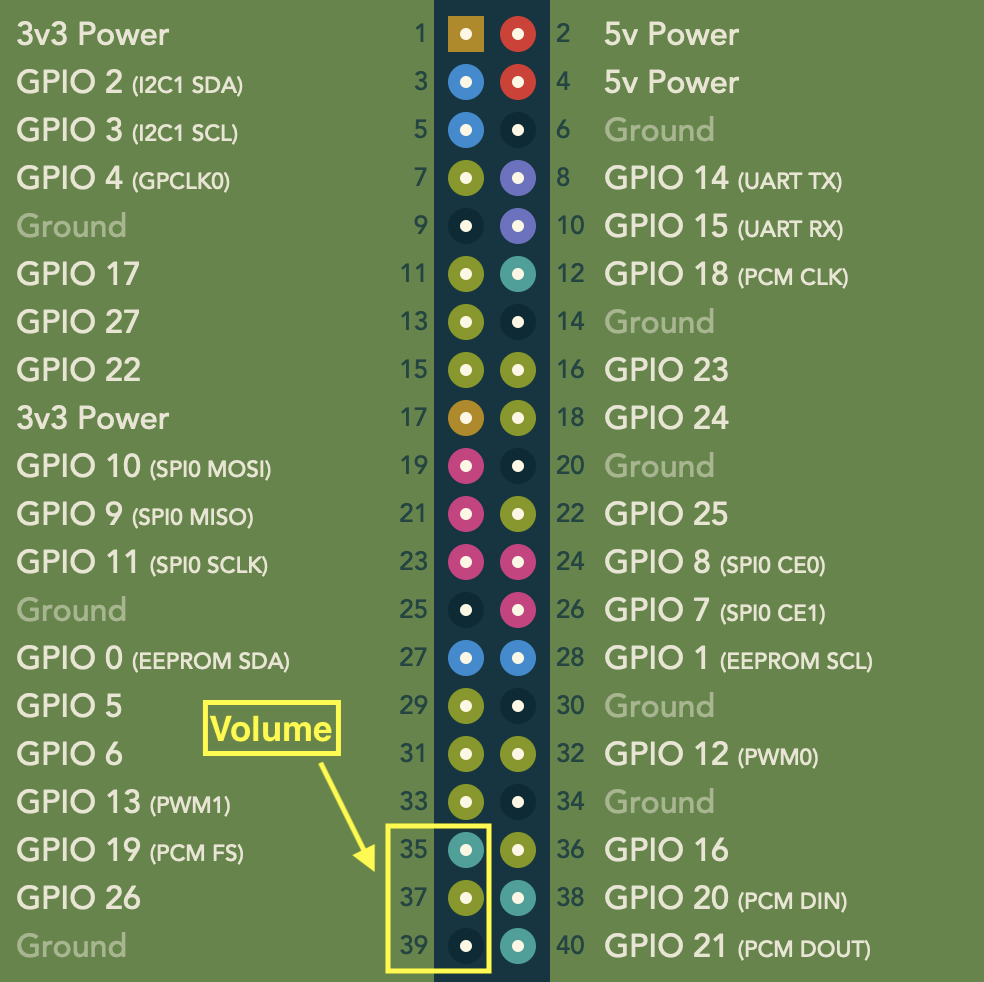

# pivolume
Control Raspberry Pi volume through GPIO


# How it works
This program listens for button presses and then uses the `amixer` tool to change the volume level accordingly.



You may need to experiment with the proper sound levels for your setup. Also if you are using different GPIO pins you have to reflect that in the code. The program adjusts HDMI sound levels but you may need to change for a different sound device.

```python
VOL_ADD = 1
VOL_MIN = 60
VOL_MAX = 100
 
VOL_CMD_GET = "get HDMI"
VOL_CMD_SET = "set HDMI {}%"
 
buttonUp = Button(19)
buttonDown = Button(26)
```


# Install

On your Raspberry Pi:

```sh
git clone https://github.com/koen-aerts/pivolume.git
cd pivolume
sudo cp volume.py /usr/local/bin/
sudo chmod +x /usr/local/bin/volume.py
sudo cp volume.service /lib/systemd/system/
sudo systemctl enable volume.service
sudo systemctl start volume.service
```
